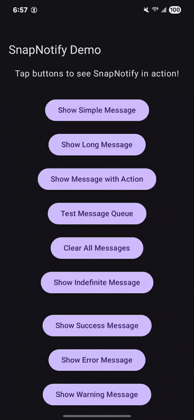

# SnapNotify

[](https://androidweekly.net/issues/issue-692)
[](https://kotlinlang.org)
[](https://developer.android.com/jetpack/compose)
[](https://android-arsenal.com/api?level=24)
[](https://opensource.org/licenses/Apache-2.0)
[](https://central.sonatype.com/artifact/io.github.ivamsi/snapnotify/1.0.4)
[](#-testing)
[](#-testing)

> A drop-in Snackbar solution for Jetpack Compose that brings back the simplicity of the View system while leveraging modern Compose patterns.

## 🎬 Demo

<div align="center">



*SnapNotify in action: Simple messages, themed styling, custom designs, and queue management*

</div>

## 🚀 The Problem

Jetpack Compose's built-in Snackbar system requires significant boilerplate:
- Manual `SnackbarHostState` management
- Passing `CoroutineScope` everywhere 
- Complex setup in every screen
- Thread-safety concerns when calling from background threads
- Cumbersome queue management for multiple messages

```kotlin
// Traditional Compose approach - lots of boilerplate 😔
@Composable
fun MyScreen() {
    val snackbarHostState = remember { SnackbarHostState() }
    val scope = rememberCoroutineScope()
    
    Scaffold(
        snackbarHost = { SnackbarHost(snackbarHostState) }
    ) {
        // Your content
        Button(
            onClick = {
                scope.launch {
                    snackbarHostState.showSnackbar("Message")
                }
            }
        ) {
            Text("Show Snackbar")
        }
    }
}
```

## ✨ The Solution

SnapNotify eliminates all the boilerplate with a clean, thread-safe API:

```kotlin
// SnapNotify approach - zero ceremony! 🎉
@Composable
fun MyScreen() {
    Button(
        onClick = { SnapNotify.show("Message") }
    ) {
        Text("Show Snackbar")
    }
}
```

## 🛠 Installation

Add to your `build.gradle.kts`:

```kotlin
dependencies {
    implementation("io.github.ivamsi:snapnotify:1.0.4")
}
```

**Hilt Integration (Optional):**
SnapNotify works with or without Hilt! If you use Hilt, no additional setup needed.

## 🎯 Quick Start

### 1. Setup (Flexible Usage)

Wrap your content with `SnapNotifyProvider` where you want snackbar functionality:

**App-wide snackbars:**
```kotlin
class MainActivity : ComponentActivity() {
    override fun onCreate(savedInstanceState: Bundle?) {
        super.onCreate(savedInstanceState)
        setContent {
            SnapNotifyProvider {
                MyAppContent() // Entire app has snackbar access
            }
        }
    }
}
```

**Screen-specific snackbars:**
```kotlin
@Composable
fun MyScreen() {
    SnapNotifyProvider {
        // Only this screen and its children can show snackbars
        ScreenContent()
    }
}
```

**Feature-scoped snackbars:**
```kotlin
@Composable
fun ShoppingCart() {
    Card {
        SnapNotifyProvider {
            // Snackbars appear within this card's bounds
            CartItems()
            AddToCartButton()
        }
    }
}
```

**Custom styled snackbars:**
```kotlin
@Composable
fun MyScreen() {
    SnapNotifyProvider(
        style = SnackbarStyle.error() // Pre-built error styling
    ) {
        ScreenContent()
    }
}
```

### 2. Usage (Anywhere in your app)

```kotlin
// Simple message
SnapNotify.show("Operation completed successfully!")

// With action button
SnapNotify.show("Error occurred", "Retry") { 
    retryOperation() 
}

// With custom duration
SnapNotify.show("Long message", duration = SnackbarDuration.Long)

// With custom duration in milliseconds
SnapNotify.show("7 second message", durationMillis = 7000)

// Clear all pending messages
SnapNotify.clearAll()

// Themed styling methods
SnapNotify.showSuccess("Operation completed!")
SnapNotify.showError("Something went wrong!")
SnapNotify.showWarning("Please check your input!")
SnapNotify.showInfo("Here's some information!")

// Themed methods with actions
SnapNotify.showSuccess("File saved!", "View") { openFile() }
SnapNotify.showError("Upload failed", "Retry") { retryUpload() }

// Themed methods with custom duration
SnapNotify.showError("Network timeout", "Retry", { retry() }, durationMillis = 8000)
SnapNotify.showSuccess("Quick success!", durationMillis = 2000)

// Custom styling for specific messages
val customStyle = SnackbarStyle(
    containerColor = Color(0xFF6A1B9A),
    contentColor = Color.White,
    actionColor = Color(0xFFE1BEE7)
)
SnapNotify.showStyled("Custom styled message!", customStyle)
SnapNotify.showStyled("10 second custom style", customStyle, durationMillis = 10000)
```

## 🌟 Key Features

### 🆕 Latest Updates
- **Custom Duration Support**: Now supports precise millisecond timing control for all methods
- **Enhanced Thread Safety**: Improved concurrent access handling and error resilience
- **Expanded Test Coverage**: 65+ tests covering custom durations and edge cases

### ✅ Flexible Setup
- Use `SnapNotifyProvider` at any level of your app hierarchy
- App-wide, screen-specific, or feature-scoped snackbars
- No `SnackbarHostState` or `CoroutineScope` management needed

### ✅ Thread-Safe
- Call from ViewModels and Composables safely
- Background thread support with proper synchronization
- No more `IllegalStateException` crashes

### ✅ Smart Queue Management  
- Handles multiple rapid Snackbar triggers gracefully
- No overlapping or lost messages
- Singleton architecture prevents duplicate displays

### ✅ Lifecycle-Aware
- Survives configuration changes
- Prevents memory leaks
- Automatic provider deduplication

### ✅ Action Support
- Optional action buttons with callbacks
- Seamless integration with your business logic

### ✅ Comprehensive Styling
- **Pre-built themes**: Success, Error, Warning, Info with semantic colors
- **Themed methods**: `showSuccess()`, `showError()`, `showWarning()`, `showInfo()`
- **Custom styling**: `showStyled()` for per-message customization
- **Full customization**: Colors, shapes, elevation, typography
- **Provider-level defaults**: Set default styles for entire sections
- **Material3 integration**: Seamless with your app's design system

## 📖 Detailed Usage

### Basic Messages

```kotlin
// Simple text message
SnapNotify.show("Profile updated successfully!")

// Different durations
SnapNotify.show("Quick message", duration = SnackbarDuration.Short)
SnapNotify.show("Important info", duration = SnackbarDuration.Long)
SnapNotify.show("Persistent message", duration = SnackbarDuration.Indefinite)

// Custom durations in milliseconds
SnapNotify.show("2 second message", durationMillis = 2000)
SnapNotify.show("30 second timeout", durationMillis = 30000)
```

### Action Buttons

```kotlin
// With action callback
SnapNotify.show("Message deleted", "Undo") {
    undoDelete()
}

// Error handling with retry
SnapNotify.show("Network error", "Retry") {
    viewModel.retryNetworkCall()
}

// Clear pending messages when navigating or context changes
SnapNotify.clearAll()
```

### ⏱️ Custom Duration Control

Precise timing control with millisecond accuracy:

```kotlin
// Quick notifications (1-3 seconds)
SnapNotify.show("Quick toast", durationMillis = 1500)
SnapNotify.showSuccess("Saved!", durationMillis = 2000)

// Standard notifications (4-8 seconds)
SnapNotify.show("Processing complete", durationMillis = 5000)
SnapNotify.showInfo("New feature available", durationMillis = 6000)

// Long notifications (10+ seconds)
SnapNotify.showError("Network error - retrying in 15s", "Retry Now", {
    retryNetworkCall()
}, durationMillis = 15000)

// Custom styled with timing
val urgentStyle = SnackbarStyle(
    containerColor = Color.Red,
    contentColor = Color.White
)
SnapNotify.showStyled("Critical alert!", urgentStyle, durationMillis = 12000)

// With action buttons - users can still interact before timeout
SnapNotify.showWarning("Auto-save in 10 seconds", "Save Now", {
    saveManually()
}, durationMillis = 10000)
```

**Key Benefits:**
- **Precise Control**: Set exact durations from 1ms to several minutes
- **User Priority**: Action buttons remain functional during custom timeouts
- **All Methods**: Works with `show()`, `showSuccess()`, `showError()`, `showWarning()`, `showInfo()`, and `showStyled()`
- **Automatic Cleanup**: Messages auto-dismiss after the specified time
- **Thread-Safe**: Safe to call from background threads with custom durations

### 🎨 Themed Messages

Quick, semantic styling with pre-built themes:

```kotlin
// Success messages (green theme)
SnapNotify.showSuccess("Profile updated successfully!")
SnapNotify.showSuccess("File uploaded!", "View") { openFile() }

// Error messages (red theme)
SnapNotify.showError("Network connection failed!")
SnapNotify.showError("Save failed", "Retry") { attemptSave() }

// Warning messages (orange theme)
SnapNotify.showWarning("Low storage space!")
SnapNotify.showWarning("Unsaved changes", "Save") { saveChanges() }

// Info messages (blue theme)
SnapNotify.showInfo("New feature available!")
SnapNotify.showInfo("Update available", "Download") { startUpdate() }
```

### 🎨 Custom Styling

**Per-message custom styling:**
```kotlin
val customStyle = SnackbarStyle(
    containerColor = Color(0xFF6A1B9A),
    contentColor = Color.White,
    actionColor = Color(0xFFE1BEE7),
    shape = RoundedCornerShape(16.dp),
    elevation = 12.dp
)

SnapNotify.showStyled("Custom styled message!", customStyle)
SnapNotify.showStyled("With action", customStyle, "Action") { doAction() }
```

### Styling Options

**Pre-built themes:**
```kotlin
// Success theme (green)
SnapNotifyProvider(style = SnackbarStyle.success()) {
    // Content
}

// Error theme (red)
SnapNotifyProvider(style = SnackbarStyle.error()) {
    // Content
}

// Warning theme (orange)
SnapNotifyProvider(style = SnackbarStyle.warning()) {
    // Content
}

// Info theme (blue)
SnapNotifyProvider(style = SnackbarStyle.info()) {
    // Content
}
```

**Custom styling:**
```kotlin
SnapNotifyProvider(
    style = SnackbarStyle(
        containerColor = Color(0xFF9C27B0),
        contentColor = Color.White,
        actionColor = Color(0xFFE1BEE7),
        shape = RoundedCornerShape(16.dp),
        elevation = 12.dp,
        messageTextStyle = MaterialTheme.typography.bodyLarge.copy(
            fontWeight = FontWeight.Medium
        ),
        actionTextStyle = MaterialTheme.typography.labelLarge.copy(
            fontWeight = FontWeight.Bold
        )
    )
) {
    // Content with custom-styled snackbars
}
```

### Clean Architecture Usage

Following best practices, handle UI notifications in the presentation layer:

```kotlin
// ✅ Recommended: ViewModels handle notifications
class ProfileViewModel : ViewModel() {
    private val repository = UserRepository()
    
    fun saveProfile() {
        viewModelScope.launch {
            try {
                repository.saveProfile()
                SnapNotify.showSuccess("Profile saved!")
            } catch (e: Exception) {
                SnapNotify.showError("Save failed", "Retry") { saveProfile() }
            }
        }
    }
}

// ✅ Clean: Repositories focus on data operations
class UserRepository {
    suspend fun saveProfile(): Result<Unit> {
        return try {
            api.updateProfile()
            Result.success(Unit)
        } catch (e: Exception) {
            Result.failure(e)
        }
    }
}

// ✅ Alternative: Direct from Composables
@Composable
fun SaveButton() {
    val viewModel: ProfileViewModel = hiltViewModel()
    
    Button(
        onClick = {
            viewModel.saveProfile()
            // SnapNotify calls handled in ViewModel
        }
    ) {
        Text("Save")
    }
}
```

## 🏗 Architecture & Best Practices

SnapNotify follows clean architecture principles with proper separation of concerns:

```
┌─────────────────┐    ┌──────────────────┐    ┌─────────────────┐
│   SnapNotify    │───▶│ SnackbarManager  │───▶│ SnapNotifyVM    │
│   (Public API)  │    │   (Singleton)    │    │   (ViewModel)   │
└─────────────────┘    └──────────────────┘    └─────────────────┘
                                │                        │
                                ▼                        ▼
                       ┌──────────────────┐    ┌─────────────────┐
                       │  Message Queue   │    │ SnapNotify UI   │
                       │   (StateFlow)    │    │  (Composable)   │
                       └──────────────────┘    └─────────────────┘
```

### Architectural Layers
- **Presentation Layer**: ViewModels and Composables handle SnapNotify calls
- **Domain Layer**: Use Cases return `Result<T>` or throw exceptions
- **Data Layer**: Repositories focus purely on data operations
- **UI Layer**: SnapNotifyProvider manages display and styling

### Design Principles
- **Thread Safety**: Internal mutex synchronization for concurrent access
- **Clean Architecture**: UI concerns separated from business logic
- **Reactive Streams**: StateFlow-based message queue management  
- **Optional DI**: Works with or without dependency injection frameworks
- **Single Responsibility**: Each component has a focused purpose

## 🔧 Configuration

### Custom Styling

```kotlin
SnapNotifyProvider(
    modifier = Modifier.padding(16.dp) // Custom positioning
) {
    MyAppContent()
}
```

### Hilt Integration (Optional)

SnapNotify works without any DI framework. If you use Hilt in your project, it integrates seamlessly - no additional setup needed!

## 📋 API Reference

### SnapNotify Object

```kotlin
object SnapNotify {
    // Basic messages
    fun show(message: String, duration: SnackbarDuration = SnackbarDuration.Short)
    fun show(message: String, duration: SnackbarDuration = SnackbarDuration.Short, durationMillis: Long? = null)
    fun show(
        message: String,
        actionLabel: String,
        onAction: () -> Unit,
        duration: SnackbarDuration = SnackbarDuration.Short
    )
    fun show(
        message: String,
        actionLabel: String,
        onAction: () -> Unit,
        duration: SnackbarDuration = SnackbarDuration.Short,
        durationMillis: Long? = null
    )
    
    // Custom styled messages
    fun showStyled(
        message: String,
        style: SnackbarStyle,
        duration: SnackbarDuration = SnackbarDuration.Short
    )
    fun showStyled(
        message: String,
        style: SnackbarStyle,
        duration: SnackbarDuration = SnackbarDuration.Short,
        durationMillis: Long? = null
    )
    fun showStyled(
        message: String,
        style: SnackbarStyle,
        actionLabel: String,
        onAction: () -> Unit,
        duration: SnackbarDuration = SnackbarDuration.Short
    )
    fun showStyled(
        message: String,
        style: SnackbarStyle,
        actionLabel: String,
        onAction: () -> Unit,
        duration: SnackbarDuration = SnackbarDuration.Short,
        durationMillis: Long? = null
    )
    
    // Themed messages (all support durationMillis parameter)
    fun showSuccess(message: String, duration: SnackbarDuration = SnackbarDuration.Short, durationMillis: Long? = null)
    fun showSuccess(
        message: String,
        actionLabel: String,
        onAction: () -> Unit,
        duration: SnackbarDuration = SnackbarDuration.Short,
        durationMillis: Long? = null
    )

    fun showError(message: String, duration: SnackbarDuration = SnackbarDuration.Short, durationMillis: Long? = null)
    fun showError(
        message: String,
        actionLabel: String,
        onAction: () -> Unit,
        duration: SnackbarDuration = SnackbarDuration.Short,
        durationMillis: Long? = null
    )

    fun showWarning(message: String, duration: SnackbarDuration = SnackbarDuration.Short, durationMillis: Long? = null)
    fun showWarning(
        message: String,
        actionLabel: String,
        onAction: () -> Unit,
        duration: SnackbarDuration = SnackbarDuration.Short,
        durationMillis: Long? = null
    )

    fun showInfo(message: String, duration: SnackbarDuration = SnackbarDuration.Short, durationMillis: Long? = null)
    fun showInfo(
        message: String,
        actionLabel: String,
        onAction: () -> Unit,
        duration: SnackbarDuration = SnackbarDuration.Short,
        durationMillis: Long? = null
    )
    
    // Management
    fun clearAll()
}
```

### SnapNotifyProvider Composable

```kotlin
@Composable
fun SnapNotifyProvider(
    modifier: Modifier = Modifier,
    style: SnackbarStyle? = null,
    content: @Composable () -> Unit
)
```

### SnackbarStyle Data Class

```kotlin
data class SnackbarStyle(
    val containerColor: Color = Color.Unspecified,
    val contentColor: Color = Color.Unspecified,
    val actionColor: Color = Color.Unspecified,
    val shape: Shape? = null,
    val elevation: Dp? = null,
    val messageTextStyle: TextStyle? = null,
    val actionTextStyle: TextStyle? = null
) {
    companion object {
        @Composable fun default(): SnackbarStyle
        @Composable fun success(): SnackbarStyle
        @Composable fun error(): SnackbarStyle
        @Composable fun warning(): SnackbarStyle
        @Composable fun info(): SnackbarStyle
    }
}
```

## 🧪 Testing

SnapNotify includes comprehensive test coverage with **65+ test cases** covering **100% of the public API**:

### Test Coverage
- **✅ Public API Methods**: All 13 SnapNotify methods tested
- **✅ Custom Duration System**: Complete SnackbarDurationWrapper functionality
- **✅ Styling System**: Complete SnackbarStyle functionality
- **✅ Message Queueing**: Thread-safe queue management
- **✅ Action Callbacks**: User interaction handling
- **✅ Timeout Handling**: Custom duration timeout behavior
- **✅ Edge Cases**: Boundary value testing and error scenarios
- **✅ Integration Tests**: End-to-end behavior verification

### Running Tests
```bash
# Run unit tests
./gradlew :snapnotify:test

# Run all tests including UI tests
./gradlew :snapnotify:check

# View test report
open snapnotify/build/reports/tests/testDebugUnitTest/index.html
```

The comprehensive test suite ensures reliability and catches regressions during development.

## 📱 Example App

Check out the `SnapNotifyDemo` module for a complete demo:

```bash
# Build and install demo app
./gradlew :SnapNotifyDemo:installDebug
```

## 📄 License

```
Copyright 2025 Vamsi Vaddavalli

Licensed under the Apache License, Version 2.0 (the "License");
you may not use this file except in compliance with the License.
You may obtain a copy of the License at

    http://www.apache.org/licenses/LICENSE-2.0

Unless required by applicable law or agreed to in writing, software
distributed under the License is distributed on an "AS IS" BASIS,
WITHOUT WARRANTIES OR CONDITIONS OF ANY KIND, either express or implied.
See the License for the specific language governing permissions and
limitations under the License.
```
